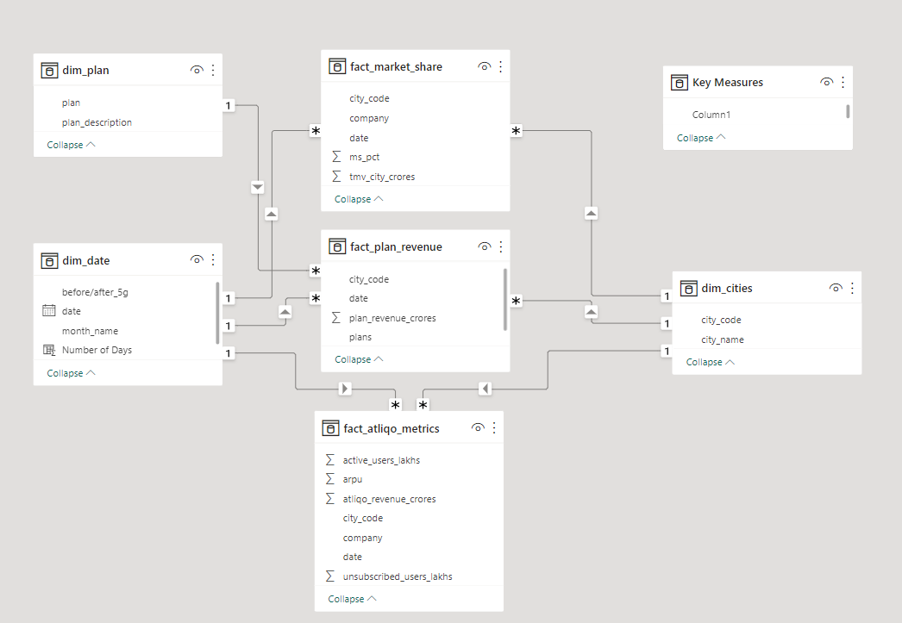
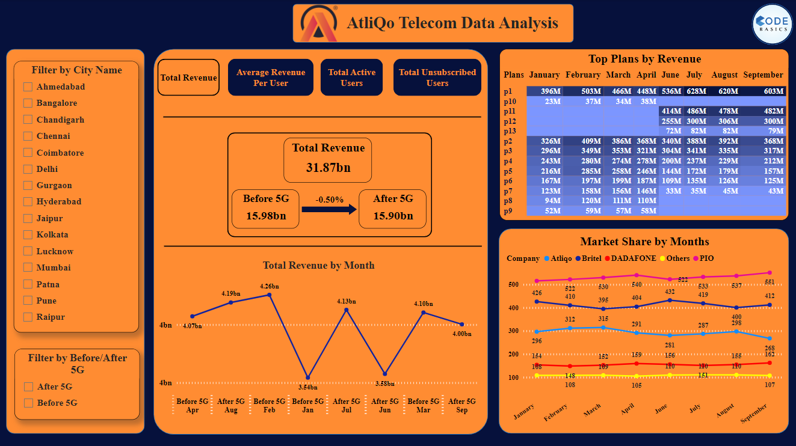

# Telecom-Data-Analysis
Developed an insightful project that analyzed the performance of our telecom services before and after the 5G launch. This project aimed to provide key stakeholders with a comprehensive and intuitive tool to track performance metrics, make data-driven decisions, and drive business growth.

## Problem Statement
AtliQo is one of the leading telecom providers in India and launched its 5G plans in May 2022 along with other telecom providers.

However, the management noticed a decline in their active users and revenue growth post 5G launch in May 2022. AtliQo’s business director requested their analytics team to provide a comparison report of KPIs between pre- and post-periods of the 5G launch. The management is keen to compare the performance between these periods and get insights that would enable them to make informed decisions to recover their active user rate and other key metrics. They also wonder if they can optimize their internet plans to get more active users.  Peter Pandey, a junior data analyst, is assigned to this task.

## Task
Imagine yourself as Peter Pandey and perform the following task:

•	Create the comparison report based on the mock-up provided. Please note the mock-up is created by a business user who has minimal idea about dashboarding. Hence, you need to represent the insights in a much better way.

•	The target audience of this dashboard is top-level management - hence the dashboard should be self-explanatory and easy to understand.

•	Create relevant insights not provided in the metric list/mock-up dashboard to support the cause.

## Data Model


## Dashboard


## Some Important insights from the dashboard:
•	Highest revenue was generated in Lucknow, while the lowest revenue was generated in Chennai.

•	Overall, there has been an increase of 11.05% of Average Revenue Per User (ARPU) after introduction of 5G.

•	Mumbai is the only city with decrease in unsubscribed users.

•	Plan p1has been overall strongest selling product of the company and has started performing even better after introduction to 5G.

•	Plan p2 & p3 have showed slight growth which indicates that these two can be a reliable source of income in future.

## Want to create dashboard like this?
#### [Related Projects](https://codebasics.io/resources)

## How to run?
### Clone the repository
```bash
  https://github.com/harshmehta01/Telecom-Data-Analysis.git
```
### ... OR Create a new repository on the command line
```bash
  git init
  git add README.md
  git commit -m "first commit"
  git branch -M main
  git remote add origin https://github.com/harshmehta01/Telecom-Data-Analysis.git
  git push -u origin main
```
### ... OR Push an existing repository from the command line
```bash
  git remote add origin https://github.com/harshmehta01/Telecom-Data-Analysis.git
  git branch -M main
  git push -u origin main
```
